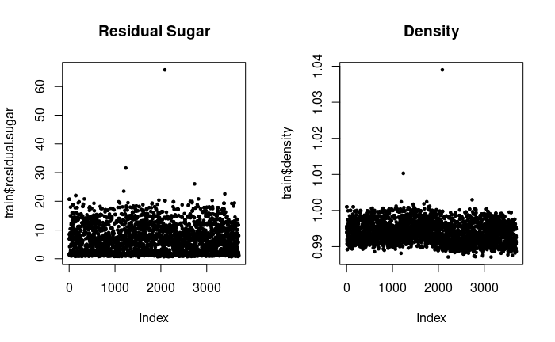
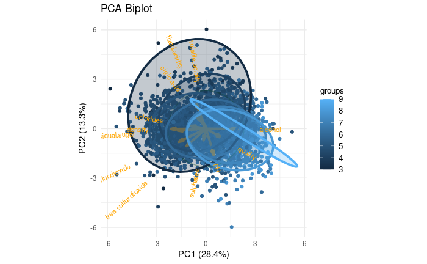
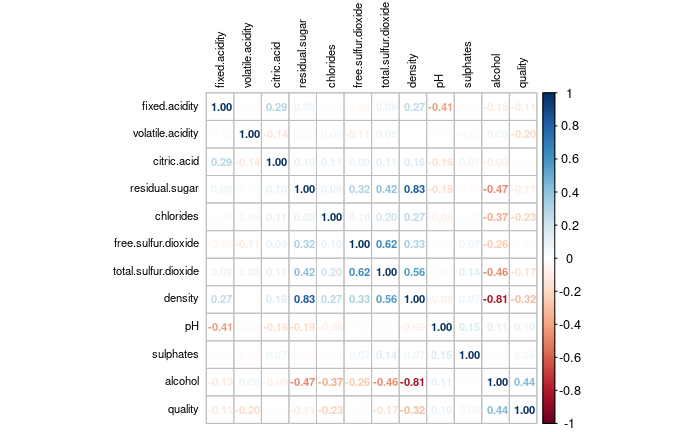
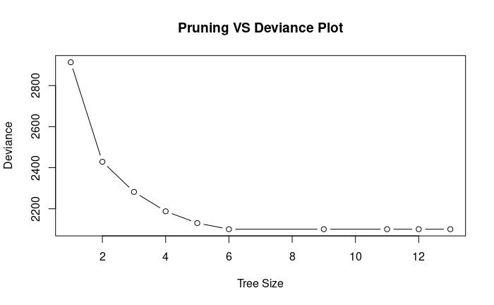

## Introduction
This report, related to the Data Mining course (A.Y. 2023-24), is about the Wine Quality Challenge. The goal of the challenge is to predict the quality of wine based on its chemical properties. The dataset contains 12 features and the target variable is the quality of the wine, which is a continuous variable.

Note: in order to produce a small document, the majority of plots and the complete source code are left out. All those can be found in the source code attached.

## Exploratory Data Analysis
First of all, after the dataset is loaded, a summary of the dataset is displayed to get an initial view of the data.
By using boxplots, it is possible to check for outliers. For outliers, we consider values that are too far from the other values in the dataset, and we remove them because they are likely to be errors in the data. For example, there are some data points related to residual sugar and density that are completely out of the range of the other data points. These are likely to be errors in the data, so they are removed.


{height=75% width=75%}

Scatterplots of the features are shown to check the relationship between them. Based on the plot, 

PCA is also used to identify the most important features in the dataset in order to better understand the data. The biplot shows the relationship between the features and the quality of the wine. By default, the prcomp() function, with the option "scale = true", centers and scales the data, so we don't need to do it manually. Here PCA is only used to get an idea of the data, not to actually reduce the dimensionality of the dataset.


{height=75% width=75%}

A correlation heatmap shows the correlation between the features. The correlation matrix is calculated using the cor() function, and the heatmap is plotted using the corrplot() function. In this dataset, alcohol, density, chlorides, and volatile acidity are the most correlated features with quality.


{height=75% width=75%}


## Linear Model
All the features are numeric, no qualitative data is present. The quality is the target variable and since it can be considered as a continuous variable, we can use regression models to predict it.

During the linear model training I have used the cross-validation technique to evaluate the model. The choice falls on a LOOCV (Leave-One-Out Cross-Validation) because the dataset is not too large, because we are evaluating a linear model (for wich LOOCV is optimized), and because it is a good way to avoid overfitting.

A linear model is trained on all the features of the dataset using the caret package. The RMSE is calculated with LOOCV. After that i use the test data to predict the quality of the wine. The predictions are saved in a file for the datachallenge submission and the corresponding RMSE is calculated.

The resulting RMSE, calculated with LOOCV, is 0.7508557. The RMSE calculated on the training data is 0.7482341.

After the linear model with all the features is trained, i have used the forward stepwise selection to select a subset of most important features for the linear model. The model is trained using with the "glmStepAIC" provided by the caret package and the RMSE is calculated again both with cross validation and the test data. This time, LOOCV is too slow to run because the stepwise selection will train the model multiple times (by adding more and more features). For this reason, i use the K-fold cross-validation method with k=10.

The features excluded by the stepwise selection are: citric.acid, chlorides, total.sulfur.dioxide. A new model is trained with a subset of features. The resulting RMSE (with cross-validation) is 0.7506327 which is sligthly better than the previous linear model.

```r
# Set the cross-validation method as k-fold cross-validation
kCv <- trainControl(method = "cv", number = 10)
# Train with stepwise selection
fwStepLm <- caret::train(quality ~ ., data = train, method = "glmStepAIC", trControl = kCv,
	preProcess = c("center", "scale"), trace = FALSE)
# Print the result RMSE
fwStepLm$results$RMSE # 0.7506327
# Get the selected features
fwStepLm$finalModel$formula

# Fit the linear model with the selected features and calculate the RMSE of the model with LOOCV to compare it with the model with all features. The features not selected are citric.acid, chlorides, total.sulfur.dioxide.
selectedFormula <- formula(quality ~ fixed.acidity + volatile.acidity + residual.sugar + 
	free.sulfur.dioxide + density + pH + sulphates + alcohol)
loocv <- trainControl(method = "LOOCV")
lmFit <- caret::train(selectedFormula, data = train, method = "lm", trControl = loocv, 
	preProcess = c("center", "scale"))
lmFit$results$RMSE #0.7504533

# Predict the quality of the test set
yhat = predict(lmFit, newdata=test)
write.table(file="./DatachallengeSubmissions/fitLinearModelSubsetFeatures.txt", yhat, 
	row.names = FALSE, col.names = FALSE)

# Calculate the RMSE of the model on test data
rmse = RMSE(y=train$quality, model=lmFit)
rmse # 0.7483839

```

## Tree-Based methods
Since the results obtained with linear models are not the best, both decision trees and random forests are now used to predict the quality of the wine.

### Regression trees
The regression tree is trained on all the features using a very low pruning level. By using cross validation, it is possible to calculate and plot the deviance of the model at different pruning levels. From the plot, it is possible to see that after a pruning level of 6, the deviance is not improved, instead the risk of overfitting increases. Tree is pruned to the optimal level. The predictions are saved in a file for the datachallenge submission and the corresponding RMSE is calculated. Alcohol, volatile acidity, and free sulfur dioxide are the most important features in the tree and are those that impact the quality of the wine the most. With this dataset, the regression tree performs better than the linear model.


{height=75% width=75%}


### Random forests
As an alternative to regression trees, random forests can be used to predict the quality of the wine. Here, a grid search is performed to find the optimal mtry value for the random forest model. The mtry value is the number of features randomly sampled at each split of the tree. Cross validation is used to evaluate the different models. The random forest model with mtry = 2 is the best model trained so far. A prediction on the test set is made and uploaded to the datachallenge submission. This approach is the one that produces the best results in terms on RMSE.

```r
# Define a grid of mtry values to search over
tuneGrid <- expand.grid(mtry = seq(1, ncol(train) - 1, by = 1))
# Set up cross-validation control
rForestCtrl <- trainControl(method = "cv", number = 5, search = "grid")
# Train the model with the tuning grid
rForestFit <- train(quality ~ ., data = train, method = "rf", 
	trControl = rForestCtrl, preProcess = c("center", "scale"),
	tuneGrid = tuneGrid)
# Get the importance of each feature and plot it
importance <- importance(rForestFit$finalModel)
varImpPlot(rForestFit$finalModel)
# Predict the quality of the test set
yhat = predict(rForestFit, newdata = test)
write.table(file = "./DatachallengeSubmissions/fitRandomForestAllFeatures.txt",
	yhat, row.names = FALSE, col.names = FALSE)
# Calculate the RMSE of the model on the training data
rmse = RMSE(y=train$quality, model=rForestFit$finalModel)
print(rmse) # 0.6065538
# Get the final mtry value
rForestFit$finalModel$mtry
```

## Conclusions
For this challenge, the best model is the random forest model with mtry = 2 (RMSE of 0.6065538), the results uploaded to the Datachallenge platform confirm that, among the models viewed during the course, the random forest is the best model for this dataset. Applying a grid search on mtry and cross validation is very computationally expensive, but it allowed to find a good model. In the case of bigger datasets, it would be better to use a smaller grid search or a random search to find the optimal parameters or optimize the cross-validation method to reduce the computational cost.
